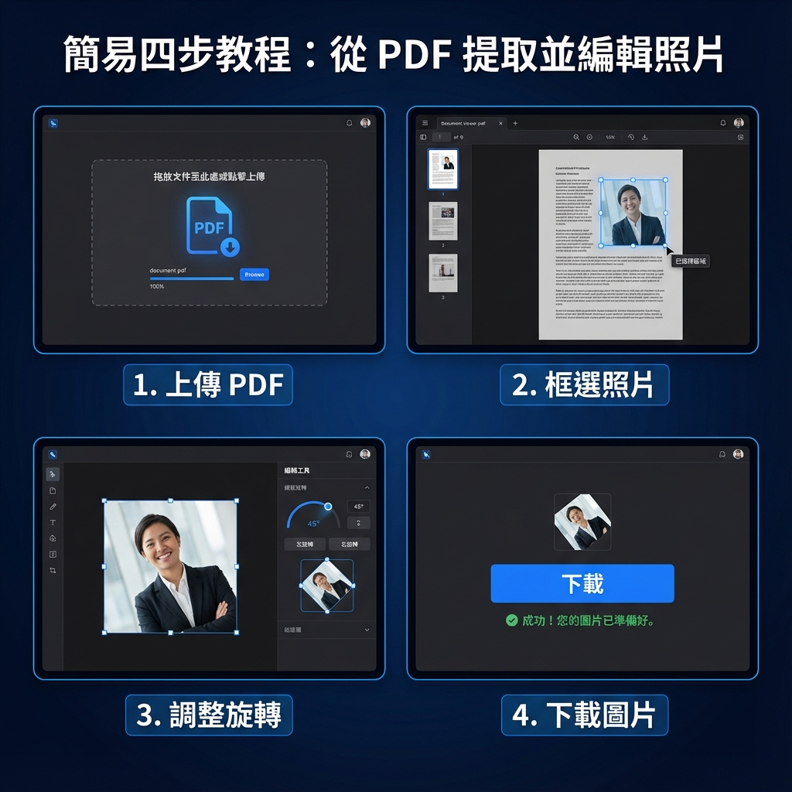

# 電測截圖工具

PDF 圖片擷取與重命名網頁應用程式

## 功能特色

- 📄 **PDF 圖片擷取**：從多頁 PDF 檔案中擷取所有頁面為圖片
- 📋 **清單重命名**：支援 CSV、TXT、xlsx、xlsm 格式的名稱清單
- 🎯 **兩種命名模式**：
  - 依序對應：按順序自動對應清單名稱
  - 手動選擇：自行為每張圖片選擇名稱
- 📐 **規格驗證**：自動檢查圖片是否符合規格要求
  - DPI: 300
  - 尺寸: 413 × 531 像素
  - 檔案大小: ≤ 1MB
- 💾 **批次下載**：支援單張下載或 ZIP 批次下載
- 🎨 **現代化介面**：深色主題，響應式設計

## 使用方式

1. **上傳 PDF 檔案**
   - 點擊「選擇 PDF」按鈕或拖放 PDF 檔案
   - 系統會自動擷取每一頁為獨立圖片

2. **上傳名稱清單（選用）**
   - 支援 CSV、TXT、xlsx、xlsm 格式
   - 清單格式：每行一個名稱

3. **選擇設定**
   - 輸出格式：JPEG 或 PNG
   - 命名方式：依序對應或手動選擇
   - JPEG 品質：可調整壓縮品質

4. **選取並下載**
   - 點擊圖片卡片選取/取消選取
   - 使用「全選」按鈕快速選取所有圖片
   - 點擊「下載選取的圖片」進行下載

## 操作教學



### 詳細步驟說明

1. **上傳 PDF**
   - 支援多頁 PDF 文件
   - 自動解析所有頁面

2. **框選照片**
   - 在頁面上拖曳滑鼠框選所需區域
   - 支援「統一選取」（所有頁面相同位置）或「逐頁選取」

3. **調整旋轉**
   - 框選後可調整照片角度 (-180° ~ 180°)
   - 照片會在固定框架內旋轉
   - 可配合縮放調整大小

4. **下載圖片**
   - 自動轉換為 300 DPI 高品質圖片
   - 統一尺寸：413 × 531 像素
   - 支援單張或批次 ZIP 下載

## 清單檔案格式

### TXT 格式
```
張三
李四
王五
```

### CSV 格式
```
張三
李四
王五
```

### Excel 格式 (xlsx/xlsm)
將名稱放在第一欄（A欄），每行一個名稱

## 技術說明

本工具為純前端應用，所有處理皆在瀏覽器中完成，不會上傳任何檔案到伺服器。

### 使用的技術
- HTML5 / CSS3 / JavaScript (ES6+)
- [PDF.js](https://mozilla.github.io/pdf.js/) - PDF 解析
- [SheetJS](https://sheetjs.com/) - Excel 讀取
- [JSZip](https://stuk.github.io/jszip/) - ZIP 打包
- [FileSaver.js](https://github.com/eligrey/FileSaver.js/) - 檔案下載

## GitHub Pages 部署

1. 在 GitHub 建立新的儲存庫
2. 將所有檔案推送至儲存庫
3. 前往 Settings > Pages
4. Source 選擇 "Deploy from a branch"
5. Branch 選擇 "main" 和 "/ (root)"
6. 儲存後等待部署完成

部署完成後，即可透過 `https://你的用戶名.github.io/儲存庫名稱/` 存取

## 檔案結構

```
電測截圖/
├── index.html          # 主頁面
├── css/
│   └── style.css       # 樣式表
├── js/
│   ├── app.js          # 主程式
│   ├── pdf-handler.js  # PDF 處理模組
│   ├── list-handler.js # 清單處理模組
│   └── image-handler.js # 圖片處理模組
└── README.md           # 本說明文件
```

## 瀏覽器支援

- Chrome 80+
- Firefox 75+
- Edge 80+
- Safari 13+

## 授權

MIT License
